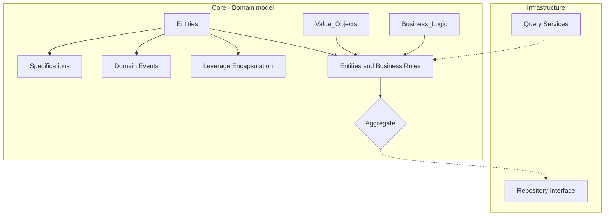

## Core (Domain Model) Project

In Clean Architecture, the central focus should be on Entities and business rules.

In Domain-Driven Design, this is the Domain Model.

This project should contain all of your Entities, Value Objects, and business logic.

Entities that are related and should change together should be grouped into an Aggregate.

Entities should leverage encapsulation and should minimize public setters.

Entities can leverage Domain Events to communicate changes to other parts of the system.

Entities can define Specifications that can be used to query for them.

For mutable access, Entities should be accessed through a Repository interface.

Read-only ad hoc queries can use separate Query Services that don't use the Domain Model.

Need help? Check out the sample here:
https://github.com/ardalis/CleanArchitecture/tree/main/sample

Still need help?
Contact us at https://nimblepros.com
