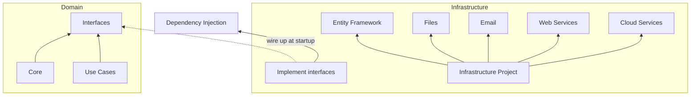

## Infrastructure Project

In Clean Architecture, Infrastructure concerns are kept separate from the core business rules (or domain model in DDD).

The only project that should have code concerned with EF, Files, Email, Web Services, Azure/AWS/GCP, etc is Infrastructure.

Infrastructure should depend on Core (and, optionally, Use Cases) where abstractions (interfaces) exist.

Infrastructure classes implement interfaces found in the Core (Use Cases) project(s).

These implementations are wired up at startup using DI. In this case using `Microsoft.Extensions.DependencyInjection` and extension methods defined in each project.

Need help? Check out the sample here:
https://github.com/ardalis/CleanArchitecture/tree/main/sample

Still need help?
Contact us at https://nimblepros.com
