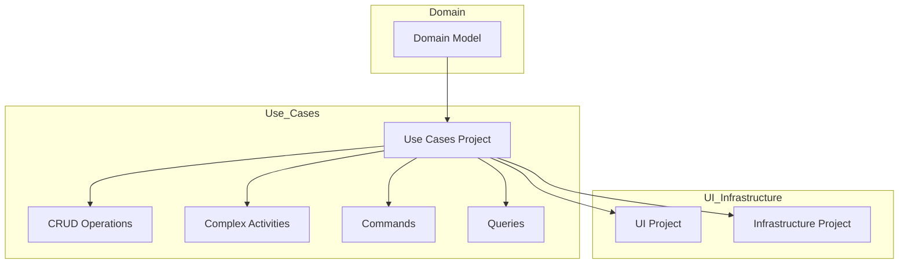

## Use Cases Project

In Clean Architecture, the Use Cases (or Application Services) project is a relatively thin layer that wraps the domain model.

Use Cases are typically organized by feature. These may be simple CRUD operations or much more complex activities.

Use Cases should not depend directly on infrastructure concerns, making them simple to unit test in most cases.

Use Cases are often grouped into Commands and Queries, following CQRS.

Having Use Cases as a separate project can reduce the amount of logic in UI and Infrastructure projects.

For simpler projects, the Use Cases project can be omitted, and its behavior moved into the UI project, either as separate services or MediatR handlers, or by simply putting the logic into the API endpoints.

For ideas on organizing your Use Case project's folder structure, see this thread:
https://twitter.com/ardalis/status/1686406393018945536

Need help? Check out the sample here:
https://github.com/ardalis/CleanArchitecture/tree/main/sample

Still need help?
Contact us at https://nimblepros.com
